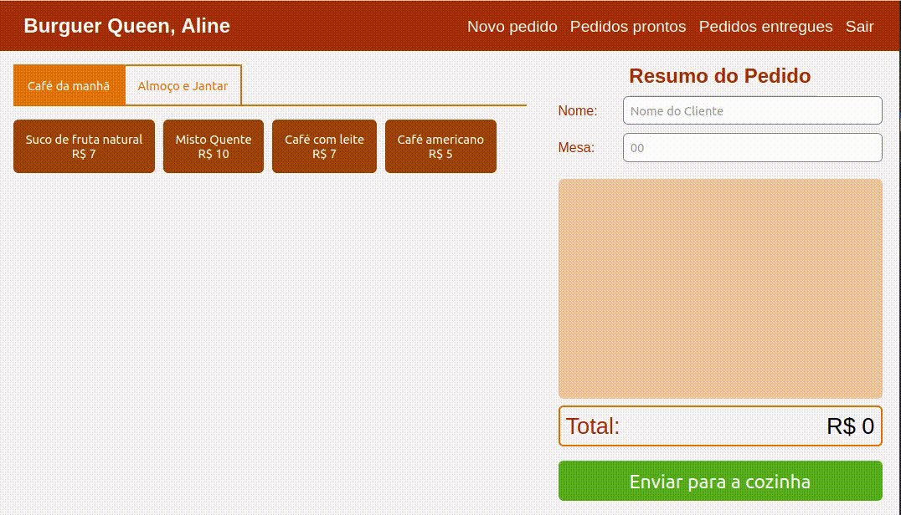
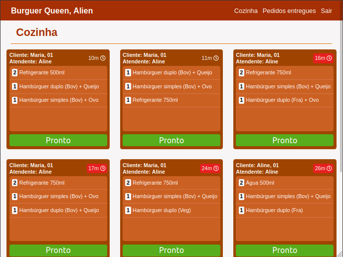
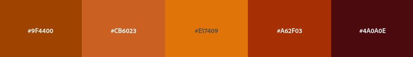
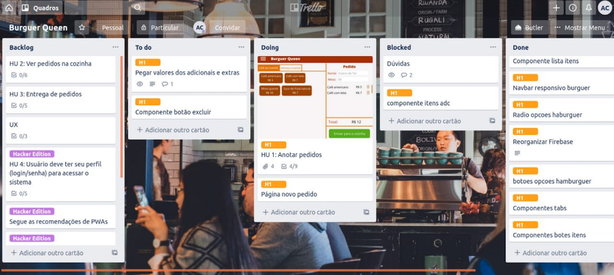

# Burger Queen

>Interface de pedidos _serverless_ para restaurante fast-food em React.js.
>
> _Projeto realizado durante o bootcamp da Laboratória._
>
> #### Logins de teste:
>
> *Acesso da cozinha: cozinha@mail.com*
>
> *Acesso do salão: salao@mail.com*
>
> ***Senha de ambos**: 123456*

## Índice

* [1. Resumo do projeto](#1-resumo-do-projeto)
* [2. Critérios mínimos de aceitação do projeto](#2-critérios-mínimos-de-aceitação-do-projeto)
* [3. Interface](#3-interface)
* [4. Considerações gerais](#4-considerações-gerais)

***

## 1. Resumo do projeto

Um pequeno restaurante de hambúrgueres, que está crescendo, necessita de uma interface em que se possa realizar pedidos utilizando um _tablet_ e enviá-los
para a cozinha para que sejam preparados de forma ordenada e eficiente.

Estas são as informações que temos do cliente:

> Somos **Burger Queen**, um fast food 24hrs.
>
>A nossa proposta de serviço 24 horas foi muito bem recebida e, para continuar a
>crescer, precisamos de um sistema que nos ajude a receber pedidos de nossos
>clientes.
>
>Nós temos 2 menus. Um muito simples para o café da manhã:
>
>| Item                      |Preço R$|
>|---------------------------|------|
>| Café americano            |    5 |
>| Café com leite            |    7 |
>| Misto Quente              |   10 |
>| Suco de fruta natural     |    7 |
>
>E outro menu para o resto do dia:
>
>| Item                      |Preço |
>|---------------------------|------|
>|**Hambúrgueres**           |   **R$**   |
>|Hambúrguer simples         |    10|
>|Hambúrguer duplo           |    15|
>|**Acompanhamentos**        |   **R$**   |
>|Batata frita               |     5|
>|Anéis de cebola            |     5|
>|**Bebidas**                |   **R$**   |
>|Água 500ml                 |     5|
>|Água 750ml                 |     7|
>|Refrigerante 500ml         |     7|
>|Refrigerante 750ml         |    10|
>
>**Importante:** Os clientes podem escolher entre hambúrgueres de carne bovina,
>frango ou vegetariano. Além disso, por um adicional de R$ 1,00 eles podem
>adicionar queijo ou ovo.
>
>Nossos clientes são bastante indecisos, por isso é muito comum que eles mudem o
>seu pedido várias vezes antes de finalizar.

A interface deve mostrar os dois menus (café da manhã e restante do dia), cada
um com todos os seus _produtos_. O atendente deve poder escolher que _produtos_
adicionar e a interface deve mostrar o _resumo do pedido_ com o custo total.

## 2. Critérios mínimos de aceitação do projeto

### Definição do produto

O _Product Owner_ nos apresentou este _backlog_ que é o resultado do seu trabalho com o cliente até hoje.

***

#### [História de usuário 1] Atendente deve poder anotar o pedido

Eu como atendente quero poder anotar o pedido, saber o valor de cada 
produto e poder enviar o pedido para a cozinha para ser preparado.

##### Critérios de aceitação

* Anotar o nome e mesa.
* Filtrar _menu_ para _café da manhã_ e _almoço/jantar_.
* Adicionar produtos aos pedidos.
* Excluir produtos.
* Ver resumo e o total da compra.
* Enviar o pedido para a cozinha (guardar em algum banco de dados).
* Funcionar bem e se adequar a um _tablet_.

##### Definição de pronto

O acordado abaixo deve acontecer para dizer que a história está terminada:

* Você fez _testes_ de usabilidade e incorporou o _feedback_ do usuário.
* Você deu deploy de seu aplicativo.

***

#### [História de usuário 2] Chefe de cozinha deve ver os pedidos

Eu como chefe de cozinha quero ver os pedidos dos clientes em ordem, poder marcar que estão prontos e poder notificar os atendentes que o pedido está pronto para ser entregue ao cliente.

##### Critérios de aceitação

* Ver os pedidos à medida em que são feitos.
* Marcar os pedidos que foram preparados e estão prontos para serem servidos.
* Ver o tempo que levou para preparar o pedido desde que chegou, até ser marcado como concluído.
* Ver histórico dos pedidos.

##### Definição de pronto

* Você fez _testes_ de usabilidade e incorporou o _feedback_ do usuário.
* Você deu deploy de seu aplicativo.

***

#### [História de usuário 3] Atendente deve ver os pedidos prontos para servir

Eu como atendente quero ver os pedidos que estão prontos para entregá-los rapidamente aos clientes.

##### Critérios de aceitação

* Ver a lista de pedidos prontos para servir.
* Marque os pedidos que foram entregues.

##### Definição de pronto

* Você fez _testes_ de usabilidade e incorporou o _feedback_ do usuário.
* Você deu deploy de seu aplicativo.
* Os dados devem ser mantidos intactos, mesmo depois que um pedido terminado. Tudo isso para poder ter estatísticas no futuro.

***

#### [História de usuário 4 (_Hacker Edition_)] Usuário deve ter seu perfil (login/senha) para acessar o sistema.

Eu como funcionário do restaurante quero entrar na plataforma e ver apenas a tela importante para o meu trabalho.

##### Critérios de aceitação

O que deve acontecer para satisfazer as necessidades do usuário?

* Criar login e senha.
* Criar tipo de usuário (cozinha / salão).
* Entrar na tela correta para cada usuário.

##### Definição de pronto

O acordado abaixo deve acontecer para dizer que a história está terminada:

* Você fez testes de usabilidade e incorporou o feedback do usuário.
* Você deu deploy de seu aplicativo.

***
## 3. Interface

#### Página de novo pedido

#### Página da cozinha

#### Paleta de cores utilizada

***

## 4. Considerações Gerais

* Interface foi pensada específicamente para rodar em **tablets**.
* Aplicativo Web **responsivo**.
* O aplicativo é um _Single Page App_.
* Segue as recomendações de PWAs.

Ferramentas e bibliotecas: 
 * JavaScript (ES6 +)
 * React.js (Hooks)
 * [Aphrodite](https://github.com/Khan/aphrodite)
 * [Firebase](https://firebase.google.com/docs?hl=pt-br)
 * [React Router Dom](https://reacttraining.com/react-router/web/guides/quick-start)
 * [React Notifications Component](https://github.com/teodosii/react-notifications-component)
 * [Animate.css](https://daneden.github.io/animate.css/)
 * [Font Awesome](https://fontawesome.com/how-to-use/on-the-web/using-with/react)
 * [Prop Types](https://www.npmjs.com/package/prop-types)
 * [Eslint](https://www.npmjs.com/package/eslint-plugin-react)
 * [Prettier](https://prettier.io/)
 * [Trello](https://trello.com)
 
 
